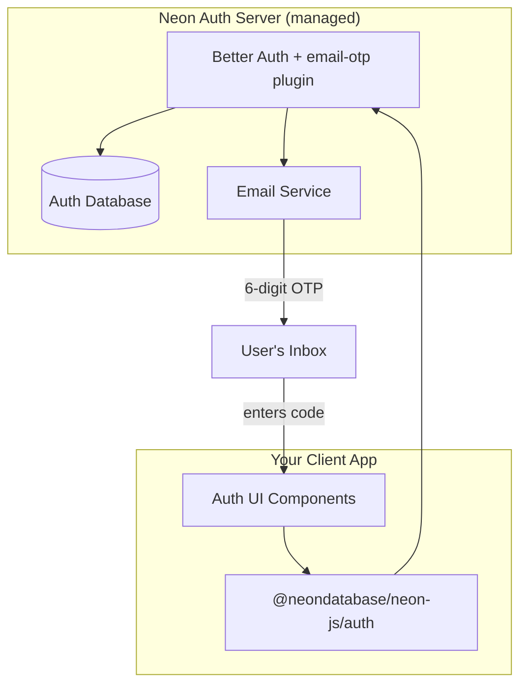
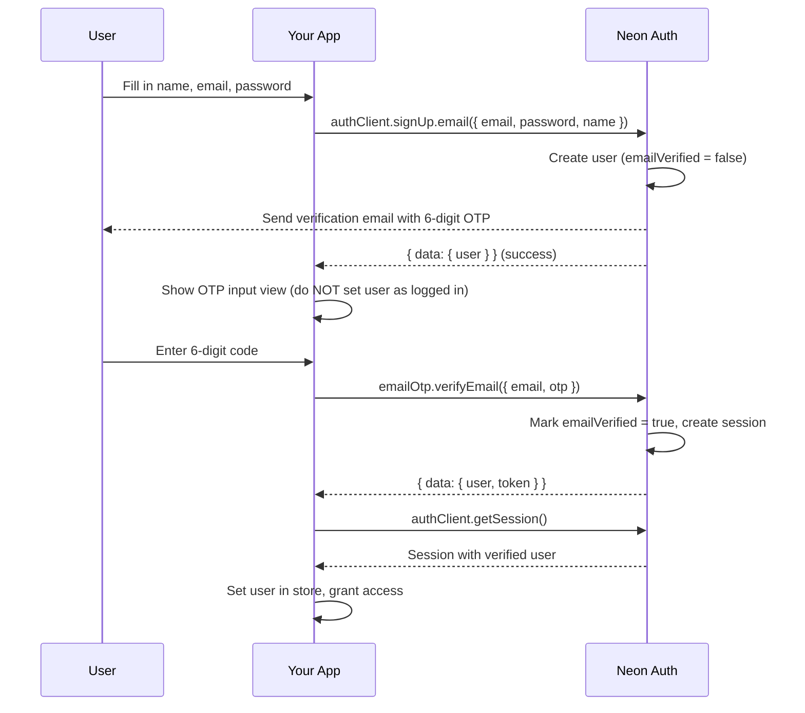
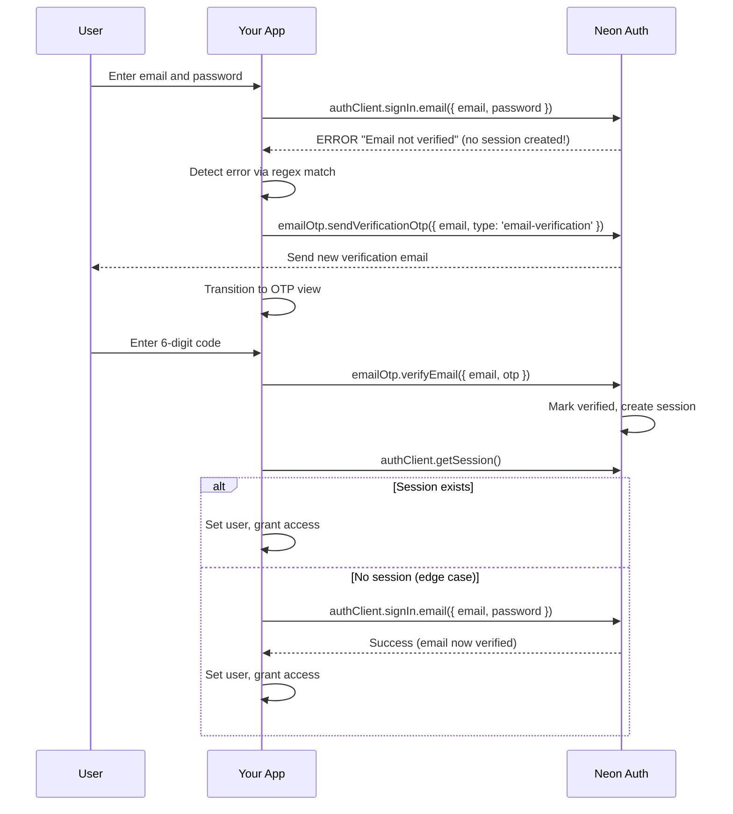
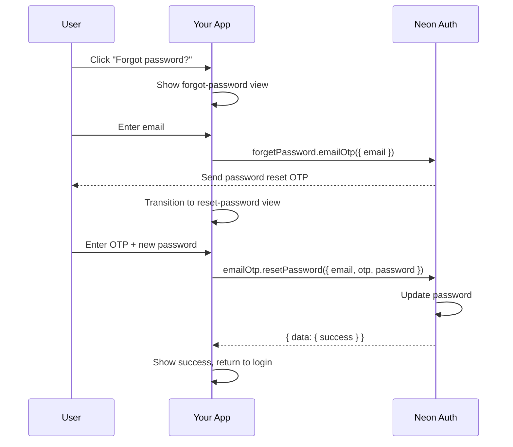
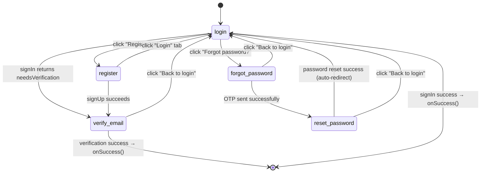

# Neon Auth Email Verification & Password Reset — A Complete Integration Guide

> **Audience:** Developers using Neon Auth (which wraps [Better Auth](https://better-auth.com)) with the `email-otp` plugin in a React + TypeScript project.
>
> **What this guide covers:** Enabling the email verification flow that Neon Auth's dashboard offers but doesn't document how to wire into your frontend. By the end, you'll have working email verification on signup, unverified-user detection on sign-in, and a full password-reset flow — all using 6-digit OTP codes.
>
> This guide is based on hard-won lessons from integrating this into a production app. Every pitfall documented here was encountered and solved in a real codebase.

## Table of Contents

1. [Architecture Overview](#1-architecture-overview)
2. [Prerequisites](#2-prerequisites)
3. [Understanding the Flows](#3-understanding-the-flows)
4. [Step 1: Accessing Email-OTP Methods](#step-1-accessing-email-otp-methods-the-type-gap)
5. [Step 2: Auth Hook — Core Logic](#step-2-auth-hook--core-logic)
6. [Step 3: Multi-View Form State Machine](#step-3-multi-view-form-state-machine)
7. [Step 4: OTP Input Component](#step-4-otp-input-component)
8. [Step 5: Gating Access on emailVerified](#step-5-gating-access-on-emailverified)
9. [Pitfalls & Gotchas](#pitfalls--gotchas)
10. [Complete File Reference](#complete-file-reference)

---

## 1. Architecture Overview

Neon Auth is a managed authentication service that wraps **Better Auth** on the server side. When you enable "Verification code" mode in the Neon Auth dashboard, the server-side `email-otp` plugin is activated automatically — Neon Auth handles sending emails, generating OTPs, and verifying them.

Your job is entirely on the **client side**: building the UI flows that call the right endpoints at the right time.



**Key insight:** No server-side code changes are needed. The `email-otp` plugin runs entirely on Neon's infrastructure. You only write client code.

---

## 2. Prerequisites

1. **Neon project** with Auth enabled
2. **"Verification code" mode** turned on in Neon Auth dashboard (Settings > Email Verification)
3. **`@neondatabase/neon-js`** package installed (v0.2.0-beta.1+)
4. **Environment variable:** `VITE_NEON_AUTH_URL` (or equivalent) pointing to your Neon Auth URL

Your auth client should already be set up:

```typescript
// auth.ts
import { createAuthClient } from '@neondatabase/neon-js/auth';
export const authClient = createAuthClient(import.meta.env.VITE_NEON_AUTH_URL);
```

Basic sign-in/sign-up should already work before adding email verification.

---

## 3. Understanding the Flows

### 3.1 Registration Flow



### 3.2 Sign-In with Unverified Email

This is the trickiest flow because Better Auth **rejects the sign-in entirely** with an error, rather than returning a user object with `emailVerified: false`:



### 3.3 Password Reset Flow



### 3.4 Google OAuth (No Verification Needed)

Google-authenticated users have their email verified by Google. Neon Auth sets `emailVerified: true` automatically. No OTP flow is needed.

---

## Step 1: Accessing Email-OTP Methods (The Type Gap)

### The Problem

The Neon Auth SDK includes `emailOTPClient()` in its runtime plugin list:

```javascript
// Inside @neondatabase/auth (runtime code)
const supportedBetterAuthClientPlugins = [
  anonymousTokenClient(),
  // ... other plugins ...
  emailOTPClient(),  // <-- Methods exist at runtime!
];
```

But the TypeScript types go through a generic wrapper (`NeonAuthPublicApi<T>`) that **loses the plugin method types**. You'll get errors like:

```
TS2339: Property 'emailOtp' does not exist on type '{ signIn: ... }'
```

### The Solution

Cast through `any` to access the runtime methods. Create a typed wrapper so the rest of your code stays type-safe:

```typescript
// auth.ts
import { createAuthClient } from '@neondatabase/neon-js/auth';

export const authClient = createAuthClient(import.meta.env.VITE_NEON_AUTH_URL);

// Cast to access email-otp plugin methods that exist at runtime
const client = authClient as any;

export const emailOtp = {
  sendVerificationOtp: (email: string, type: 'email-verification' | 'sign-in' | 'forget-password') =>
    client.emailOtp.sendVerificationOtp({ email, type }) as Promise<{ data: any; error: any }>,

  verifyEmail: (email: string, otp: string) =>
    client.emailOtp.verifyEmail({ email, otp }) as Promise<{ data: any; error: any }>,

  resetPassword: (email: string, otp: string, password: string) =>
    client.emailOtp.resetPassword({ email, otp, password }) as Promise<{ data: any; error: any }>,

  forgetPassword: (email: string) =>
    client.forgetPassword.emailOtp({ email }) as Promise<{ data: any; error: any }>,
};
```

### Available Client Methods

| Method | Neon Auth Endpoint | Purpose |
|--------|-------------------|---------|
| `emailOtp.sendVerificationOtp({ email, type })` | `POST /email-otp/send-verification-otp` | Send/resend a 6-digit OTP |
| `emailOtp.verifyEmail({ email, otp })` | `POST /email-otp/verify-email` | Verify email + establish session |
| `forgetPassword.emailOtp({ email })` | `POST /forget-password/email-otp` | Send password reset OTP |
| `emailOtp.resetPassword({ email, otp, password })` | `POST /email-otp/reset-password` | Reset password with OTP |

> **Warning:** Do NOT construct these URLs manually with `fetch()`. The Neon Auth URL (e.g., `https://xxx.neonauth.aws.neon.tech/neondb/auth`) has a complex path structure, and Better Auth adds its own `/api/auth` base path. The SDK handles URL construction internally — use the plugin methods via `any` cast instead.

---

## Step 2: Auth Hook — Core Logic

The auth hook needs to handle several scenarios that aren't obvious:

```typescript
// hooks/useAuth.ts
import { useCallback } from 'react';
import { authClient, emailOtp } from '../auth';
import { useStore } from '../store';

// Better Auth returns this error when email is not verified
const EMAIL_NOT_VERIFIED_RE = /email.*(not|isn.t)\s*verified/i;

export function useAuth() {
  const setUser = useStore((s) => s.setUser);
  const clearAuth = useStore((s) => s.clearAuth);

  // --- Session check: read emailVerified from the session ---
  const checkSession = useCallback(async () => {
    const { data } = await authClient.getSession();
    if (data?.user) {
      setUser({
        id: data.user.id,
        email: data.user.email,
        name: data.user.name ?? null,
        emailVerified: !!data.user.emailVerified, // <-- critical field
      });
    } else {
      clearAuth();
    }
  }, [setUser, clearAuth]);

  // --- Sign in: intercept "email not verified" error ---
  const signIn = useCallback(async (
    email: string,
    password: string
  ): Promise<{ needsVerification?: boolean }> => {
    const { data, error } = await authClient.signIn.email({ email, password });

    if (error) {
      const msg = error.message ?? '';

      // KEY BEHAVIOR: Better Auth rejects sign-in for unverified emails.
      // Instead of showing a dead-end error, detect it and redirect to OTP.
      if (EMAIL_NOT_VERIFIED_RE.test(msg)) {
        await emailOtp.sendVerificationOtp(email, 'email-verification');
        return { needsVerification: true };
      }
      throw new Error(msg || 'Sign in failed');
    }

    // Fallback: if sign-in succeeds but email isn't verified
    if (data?.user && !data.user.emailVerified) {
      await emailOtp.sendVerificationOtp(email, 'email-verification');
      return { needsVerification: true };
    }

    if (data?.user) {
      setUser({
        id: data.user.id,
        email: data.user.email,
        name: data.user.name ?? null,
        emailVerified: true,
      });
    }
    return {};
  }, [setUser]);

  // --- Sign up: NEVER set user as logged in ---
  const signUp = useCallback(async (
    email: string,
    password: string,
    name: string
  ): Promise<{ needsVerification: true }> => {
    const { error } = await authClient.signUp.email({ email, password, name });
    if (error) throw new Error(error.message ?? 'Sign up failed');
    // Neon Auth auto-sends OTP on signup. Do NOT call setUser().
    return { needsVerification: true };
  }, []);

  // --- Verify OTP: establish session + fallback re-sign-in ---
  const verifyEmailOtp = useCallback(async (
    email: string,
    otp: string,
    savedPassword?: string
  ) => {
    const { error } = await emailOtp.verifyEmail(email, otp);
    if (error) throw new Error(error.message ?? 'Invalid code');

    // verifyEmail may establish a session — try to pick it up
    await checkSession();

    // If no session exists (sign-in was rejected earlier), re-sign-in
    const currentUser = useStore.getState().user;
    if (!currentUser && savedPassword) {
      const { data } = await authClient.signIn.email({
        email,
        password: savedPassword,
      });
      if (data?.user) {
        setUser({
          id: data.user.id,
          email: data.user.email,
          name: data.user.name ?? null,
          emailVerified: true,
        });
      }
    }
  }, [checkSession, setUser]);

  // --- Resend OTP ---
  const resendVerificationOtp = useCallback(async (email: string) => {
    const { error } = await emailOtp.sendVerificationOtp(email, 'email-verification');
    if (error) throw new Error(error.message ?? 'Failed to resend');
  }, []);

  // --- Forgot password: send reset OTP ---
  const sendPasswordResetOtp = useCallback(async (email: string) => {
    const { error } = await emailOtp.forgetPassword(email);
    if (error) throw new Error(error.message ?? 'Failed to send reset code');
  }, []);

  // --- Reset password with OTP ---
  const resetPassword = useCallback(async (
    email: string,
    otp: string,
    password: string
  ) => {
    const { error } = await emailOtp.resetPassword(email, otp, password);
    if (error) throw new Error(error.message ?? 'Failed to reset password');
  }, []);

  return {
    checkSession,
    signIn,
    signUp,
    verifyEmailOtp,
    resendVerificationOtp,
    sendPasswordResetOtp,
    resetPassword,
  };
}
```

### Critical Implementation Details

1. **`signUp` must NOT call `setUser()`** — The user exists but is unverified. Setting them as logged in bypasses verification entirely.

2. **`signIn` must detect the error, not just throw** — Better Auth returns `{ error: { message: "Email not verified" } }` with no `data.user`. If you just `throw`, the user sees an error with no way to verify.

3. **`verifyEmailOtp` needs a fallback re-sign-in** — Since the original sign-in was rejected (no session created), `verifyEmail` might not establish a session either. The fallback re-signs in with the saved password.

---

## Step 3: Multi-View Form State Machine

The auth form needs 5 views. A state machine hook manages transitions:



```typescript
// hooks/useAuthForm.ts
export type AuthView =
  | 'login'
  | 'register'
  | 'verify-email'
  | 'forgot-password'
  | 'reset-password';

export function useAuthForm(onSuccess: () => void) {
  const { signIn, signUp, verifyEmailOtp, /* ... */ } = useAuth();

  const [view, setView] = useState<AuthView>('login');
  const [email, setEmail] = useState('');
  const [password, setPassword] = useState('');
  const [otp, setOtp] = useState('');
  const [resendCooldown, setResendCooldown] = useState(0);
  // ... other state fields

  // KEY: Auto-detect unverified user from session restore
  const autoDetectedRef = useRef(false);
  useEffect(() => {
    if (user && !user.emailVerified && !autoDetectedRef.current) {
      autoDetectedRef.current = true;
      setEmail(user.email);
      setView('verify-email');
    }
  }, [user]);

  // Cooldown timer for resend button
  useEffect(() => {
    if (resendCooldown <= 0) return;
    const timer = setTimeout(() => setResendCooldown((c) => c - 1), 1000);
    return () => clearTimeout(timer);
  }, [resendCooldown]);

  const handleLogin = useCallback(async (e: React.FormEvent) => {
    e.preventDefault();
    const result = await signIn(email, password);
    if (result.needsVerification) {
      setOtp('');
      setView('verify-email');
      setResendCooldown(60);
    } else {
      onSuccess();
    }
  }, [email, password, signIn, onSuccess]);

  const handleRegister = useCallback(async (e: React.FormEvent) => {
    e.preventDefault();
    await signUp(email, password, name);
    setOtp('');
    setView('verify-email');
    setResendCooldown(60);
  }, [email, password, name, signUp]);

  const handleVerifyEmail = useCallback(async (e: React.FormEvent) => {
    e.preventDefault();
    // Pass saved password for fallback re-sign-in
    await verifyEmailOtp(email, otp, password);
    onSuccess();
  }, [email, otp, password, verifyEmailOtp, onSuccess]);

  // ... handleResendOtp, handleForgotPassword, handleResetPassword
}
```

### Why the Password Must Be Preserved

The `password` state is kept alive across the `login → verify-email` transition. This is essential because:

1. User enters email + password and clicks "Login"
2. Better Auth rejects with "Email not verified" (no session created)
3. User enters OTP and verifies
4. `verifyEmail` may not create a session
5. The hook needs to re-call `signIn.email({ email, password })` — it needs the original password

If you clear the password when transitioning views, the fallback re-sign-in fails silently.

---

## Step 4: OTP Input Component

A 6-digit OTP input with individual boxes:

```typescript
// components/OtpInput.tsx
import { useRef, useCallback } from 'react';

interface OtpInputProps {
  value: string;
  onChange: (value: string) => void;
  length?: number;
  disabled?: boolean;
}

export function OtpInput({
  value,
  onChange,
  length = 6,
  disabled = false,
}: OtpInputProps) {
  const inputsRef = useRef<(HTMLInputElement | null)[]>([]);

  // IMPORTANT: Always produce exactly `length` elements.
  // Do NOT use: value.padEnd(length, '').split('')
  // '' as padString is a no-op — produces 0 elements when value is empty!
  const digits = Array.from({ length }, (_, i) => value[i] ?? '');

  const focusInput = useCallback((index: number) => {
    inputsRef.current[index]?.focus();
  }, []);

  const handleChange = useCallback(
    (index: number, char: string) => {
      if (!/^\d?$/.test(char)) return; // digits only
      const next = [...digits];
      next[index] = char;
      onChange(next.join(''));
      if (char && index < length - 1) focusInput(index + 1);
    },
    [digits, length, onChange, focusInput]
  );

  const handleKeyDown = useCallback(
    (index: number, e: React.KeyboardEvent<HTMLInputElement>) => {
      if (e.key === 'Backspace' && !digits[index] && index > 0) {
        e.preventDefault();
        const next = [...digits];
        next[index - 1] = '';
        onChange(next.join(''));
        focusInput(index - 1);
      } else if (e.key === 'ArrowLeft' && index > 0) {
        e.preventDefault();
        focusInput(index - 1);
      } else if (e.key === 'ArrowRight' && index < length - 1) {
        e.preventDefault();
        focusInput(index + 1);
      }
    },
    [digits, length, onChange, focusInput]
  );

  const handlePaste = useCallback(
    (e: React.ClipboardEvent) => {
      e.preventDefault();
      const pasted = e.clipboardData
        .getData('text')
        .replace(/\D/g, '')
        .slice(0, length);
      if (pasted) {
        onChange(pasted);
        focusInput(Math.min(pasted.length, length - 1));
      }
    },
    [length, onChange, focusInput]
  );

  return (
    <div className="flex gap-2 justify-center">
      {digits.map((digit, i) => (
        <input
          key={i}
          ref={(el) => { inputsRef.current[i] = el; }}
          type="text"
          inputMode="numeric"
          maxLength={1}
          value={digit}
          disabled={disabled}
          onChange={(e) => handleChange(i, e.target.value)}
          onKeyDown={(e) => handleKeyDown(i, e)}
          onPaste={i === 0 ? handlePaste : undefined}
          onFocus={(e) => e.target.select()}
          className="w-11 h-12 text-center text-xl font-mono
                     bg-gray-900 border border-gray-600 rounded
                     text-white focus:outline-none focus:border-blue-400
                     disabled:opacity-50 transition-colors"
        />
      ))}
    </div>
  );
}
```

---

## Step 5: Gating Access on emailVerified

Add `emailVerified` to your user type:

```typescript
interface AuthUser {
  id: string;
  email: string;
  name: string | null;
  emailVerified: boolean; // <-- add this
}
```

Gate protected routes:

```typescript
// App.tsx — route guard
if (user && user.emailVerified) {
  // show protected content
}

// WelcomePage.tsx — conditional UI
{user?.emailVerified ? (
  <GameButtons />
) : (
  <AuthForm /> // useAuthForm auto-detects unverified user
)}
```

When a user has a session but `emailVerified === false` (e.g., browser refresh after registering but before verifying), the `useAuthForm` hook auto-detects this and transitions to the verify-email view.

---

## Pitfalls & Gotchas

### Pitfall 1: Manual `fetch()` to OTP Endpoints

**Problem:** Constructing URLs manually like `${NEON_AUTH_URL}/api/auth/email-otp/verify-email` fails because the Neon Auth URL already contains a path (e.g., `/neondb/auth`), and Better Auth adds its own `/api/auth` prefix internally.

**Symptom:** `Failed to execute 'json' on 'Response': Unexpected end of JSON input` — the endpoint doesn't exist at the constructed URL, returns an empty response.

**Solution:** Use the SDK's runtime plugin methods via `any` cast. They handle URL routing internally.

```typescript
// WRONG — manually constructing URLs
const res = await fetch(`${authBaseUrl}/api/auth/email-otp/verify-email`, { ... });
const json = await res.json(); // crashes on empty response

// CORRECT — use runtime plugin methods
const client = authClient as any;
const { data, error } = await client.emailOtp.verifyEmail({ email, otp });
```

### Pitfall 2: Sign-In Error Is a Dead End

**Problem:** When an unverified user tries to sign in, Better Auth returns `{ error: { message: "Email not verified" } }`. If you just display this error on the login form, the user has no way to verify — they're stuck.

**Symptom:** Login form shows "Email not verified" with no path forward.

**Solution:** Detect the error with a regex and redirect to the OTP verification view:

```typescript
const EMAIL_NOT_VERIFIED_RE = /email.*(not|isn.t)\s*verified/i;

if (error) {
  if (EMAIL_NOT_VERIFIED_RE.test(error.message ?? '')) {
    await emailOtp.sendVerificationOtp(email, 'email-verification');
    return { needsVerification: true };
  }
  throw new Error(error.message);
}
```

### Pitfall 3: `signUp` Setting User as Logged In

**Problem:** Calling `setUser()` after `signUp` makes the app think the user is authenticated, completely bypassing email verification.

**Symptom:** User registers and is immediately logged in without verifying their email.

**Solution:** After `signUp`, return `{ needsVerification: true }` and transition to the OTP view. Do NOT call `setUser()`.

### Pitfall 4: No Session After Verification

**Problem:** The original sign-in was rejected (no session created). After `verifyEmail`, calling `checkSession()` may not find a session.

**Symptom:** User verifies successfully but remains logged out.

**Solution:** After verification, check if a session exists. If not, re-sign-in with the saved password:

```typescript
await emailOtp.verifyEmail(email, otp);
await checkSession();

const currentUser = store.getState().user;
if (!currentUser && savedPassword) {
  await authClient.signIn.email({ email, password: savedPassword });
}
```

### Pitfall 5: `padEnd` with Empty String

**Problem:** `''.padEnd(6, '').split('')` returns `[]` — zero elements — because `padEnd` with an empty fill string is a no-op.

**Symptom:** OTP input boxes are not rendered at all. The verification view shows the title and buttons but no input fields.

**Solution:** Use `Array.from`:

```typescript
// WRONG — renders 0 inputs when value is ''
const digits = value.padEnd(length, '').split('');

// CORRECT — always renders exactly `length` inputs
const digits = Array.from({ length }, (_, i) => value[i] ?? '');
```

### Pitfall 6: Non-Standard CSS Classes

**Problem:** Using CSS utility classes that don't exist in your framework (e.g., `h-13` is not a standard Tailwind CSS class).

**Symptom:** Input boxes exist in the DOM but are invisible (zero height).

**Solution:** Always use valid utility classes. In Tailwind, height classes follow the scale: `h-10` (2.5rem), `h-11` (2.75rem), `h-12` (3rem), `h-14` (3.5rem). There is no `h-13`.

### Pitfall 7: Google OAuth Doesn't Need Verification

Google OAuth users have their email verified by Google. Neon Auth sets `emailVerified: true` automatically. Do not show the OTP flow for social auth users — only show it for email/password auth.

---

## Complete File Reference

### File Structure

```
src/
├── auth.ts                          # Auth client + emailOtp wrapper
├── hooks/
│   ├── useAuth.ts                   # Core auth logic (signIn, signUp, verify, reset)
│   └── useAuthForm.ts               # Multi-view form state machine
├── components/
│   ├── ui/
│   │   └── OtpInput.tsx             # 6-digit OTP input component
│   └── auth/
│       ├── AuthFormBody.tsx          # Renders all 5 auth views
│       ├── InlineAuthForm.tsx        # Inline variant (e.g., welcome page)
│       └── AuthModal.tsx             # Modal variant
├── stores/
│   └── slices/
│       └── authSlice.ts             # AuthUser type with emailVerified
└── App.tsx                          # Route guard checking emailVerified
```

### Auth Views

| View | Shown When | Actions Available |
|------|-----------|-------------------|
| `login` | Default | Sign in, switch to register, forgot password, Google OAuth |
| `register` | User clicks register tab | Sign up with name/email/password, Google OAuth |
| `verify-email` | After signup, after sign-in with unverified email, or session restore with unverified user | Enter OTP, resend OTP (with 60s cooldown), back to login |
| `forgot-password` | User clicks "Forgot password?" | Enter email to receive reset OTP, back to login |
| `reset-password` | After forgot-password OTP is sent | Enter OTP + new password, back to login |

### Better Auth email-otp Plugin — Server Endpoints

These are the endpoints the plugin methods call internally. You should not call them directly, but understanding them helps with debugging:

| Endpoint | Method | Body | Purpose |
|----------|--------|------|---------|
| `/email-otp/send-verification-otp` | POST | `{ email, type }` | Send OTP email |
| `/email-otp/verify-email` | POST | `{ email, otp }` | Verify email, create session |
| `/forget-password/email-otp` | POST | `{ email }` | Send password reset OTP |
| `/email-otp/reset-password` | POST | `{ email, otp, password }` | Reset password |

`type` can be: `'email-verification'`, `'sign-in'`, or `'forget-password'`.

---

## Summary

The Neon Auth email-otp integration has a straightforward server side (just enable it in the dashboard) but a surprisingly tricky client side. The main challenges are:

1. **TypeScript types don't expose the plugin methods** — use `any` cast
2. **Better Auth blocks sign-in for unverified users** — intercept the error, don't just display it
3. **Sign-in rejection means no session** — need fallback re-sign-in after verification
4. **Password must survive view transitions** — keep it in state for the re-sign-in fallback
5. **`signUp` must not set the user** — or you bypass verification entirely

Once you understand these behaviors, the implementation is clean: a typed wrapper, an auth hook with error interception, and a 5-view form state machine.
